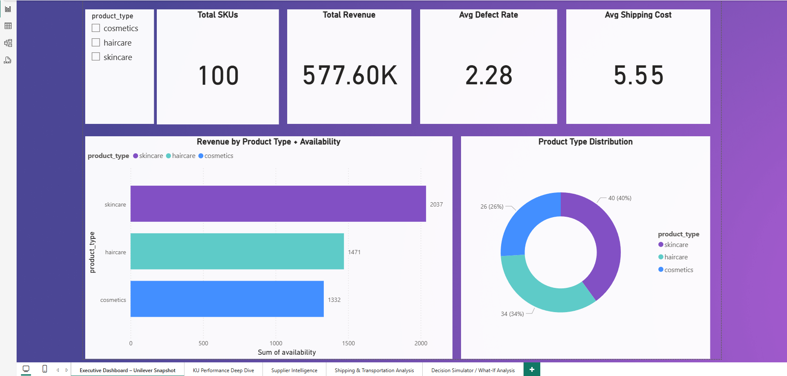
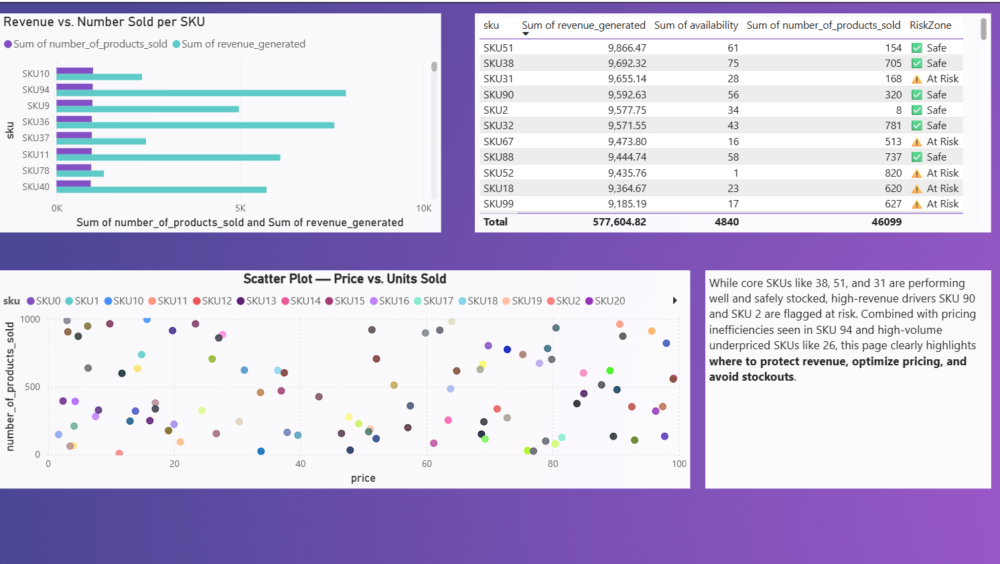
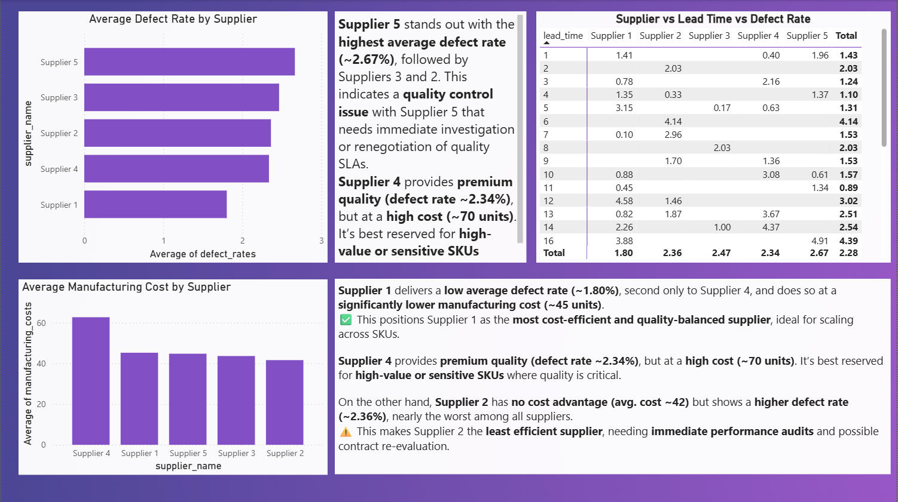
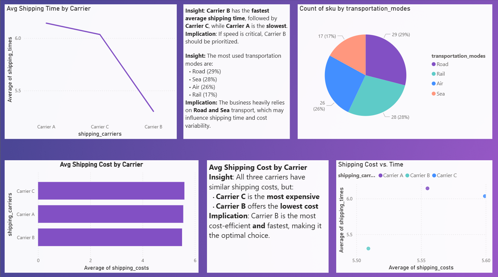
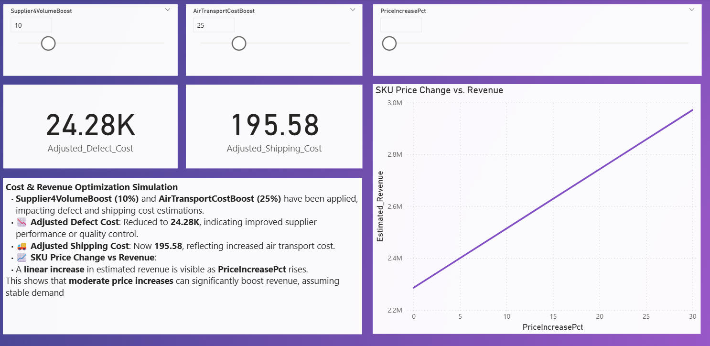

# 📦 Unilever Supply Chain Analytics Optimization

This project simulates a real-world supply chain analytics scenario inspired by Unilever Bangladesh's operations. It leverages **Python**, **SQL**, and **Power BI** to analyze SKUs, supplier performance, logistics costs, and simulate what-if business decisions — aligning perfectly with Unilever's BizLearner Program goals.



---

## 🚀 Project Objectives

- Clean and analyze Unilever-style supply chain data
- Identify operational bottlenecks and cost leaks
- Build a **multi-page interactive Power BI dashboard**
- Simulate business decisions (volume shifts, transport changes, price lifts)
- Demonstrate actionable, data-driven recommendations

---

````markdown
# 📦 Unilever Supply Chain Analytics — BizLearner Project

> A full-cycle data analytics simulation using Python, SQL, and Power BI  
> Created for Unilever Bangladesh Ltd.'s **BizLearner 2025** program  
> Focus: Supply Chain Efficiency, SKU Strategy, Supplier Performance, and Logistics Optimization

---

## 🔧 1. Python: Data Cleaning & Preparation

### ✅ Steps Performed

- Loaded raw `.xlsx` dataset using `pandas`
- Renamed inconsistent column names (e.g., spaces, capitalization)
- Converted key columns to appropriate data types (`category`, `int`, `float`)
- Checked for missing values, verified completeness
- Exported cleaned dataset as `cleaned_supply_chain_data.csv`

### 🧪 Code Snippet

```python
df = pd.read_excel("Supply Chain Analytics Uniliver.xlsx")
df.columns = df.columns.str.strip().str.lower().str.replace(" ", "_")
df['product_type'] = df['product_type'].astype('category')
df['customer_demographics'] = df['customer_demographics'].astype('category')
df['inspection_results'] = df['inspection_results'].astype('category')
df.to_csv("cleaned_supply_chain_data.csv", index=False)
```
````

---

## 🗂 2. SQL: Targeted Query Operations

### ✅ Tools Used

- DuckDB (in Colab) for in-memory SQL execution on cleaned `.csv`

### 🔍 Queries Performed

- Top revenue-generating SKUs
- SKUs with low availability but high revenue (stockout risk)
- Average defect rate by supplier
- Logistics cost breakdown by transport mode

### 🧪 Sample Query

```sql
SELECT
  sku,
  revenue_generated,
  availability
FROM cleaned_supply_chain_data
WHERE availability < 30 AND revenue_generated > 6000
ORDER BY revenue_generated DESC;
```

---

## 📊 3. Power BI: Business Dashboard & Simulation

Built a **5-page storytelling dashboard** using Power BI Desktop:

### 🧩 Dashboard Pages

1. **Overview Dashboard**

   - KPI Cards: Revenue, SKU Count, Avg Defect Rate, Avg Shipping Cost
   - Donut Chart: Product Type Distribution

2. **SKU Performance Deep Dive**

   - Bar Chart: Revenue vs. Number Sold per SKU
   - Scatter: Price vs. Volume (find outliers)
   - Table: Risk Zone SKUs (low stock, high revenue)

3. **Supplier Intelligence**

   - Avg Defect Rate & Cost per Supplier
   - Heatmap Table: Supplier vs. Lead Time vs. Defect

4. **Shipping & Logistics**

   - Avg Shipping Time & Cost by Carrier
   - Pie: Transportation Mode Share
   - Scatter: Shipping Time vs Cost Efficiency

5. **What-If Simulation**

   - Supplier 4 Volume Boost
   - Air Transport Cost Increase
   - SKU Price Change Effect on Revenue

---

## 🔧 Tools & Technologies Used

| Tool         | Purpose                                   |
| ------------ | ----------------------------------------- |
| **Python**   | Data cleaning, wrangling, EDA             |
| **Pandas**   | Exploratory statistics and transformation |
| **SQL**      | Querying key patterns for dashboard use   |
| **Power BI** | Data visualization & simulation           |
| **Excel**    | Data formatting & export management       |

---

## 📁 Folder Structure

---

## 📊 Power BI Dashboard Overview

### 🧮 Page 1: Executive KPI Dashboard

- Total SKUs
- Total Revenue
- Avg. Defect Rate
- Avg. Shipping Cost


---

### 🔎 Page 2: SKU Performance Deep Dive

- Bar chart: Revenue vs Number Sold
- Scatter plot: Price vs Units Sold
- Table: Risky SKUs (High revenue, low availability)

**Insight:**

> 5 SKUs generate 60% of revenue but 2 are understocked → risk of lost sales.



---

### 🏭 Page 3: Supplier Intelligence

- Bar: Avg. Defect Rate by Supplier
- Column: Manufacturing Cost by Supplier
- Matrix: Lead Time vs Defect Rate

**Insight:**

> Supplier 4 has low defects but high cost. Supplier 2 = highest defect rate.



---

### 🚚 Page 4: Logistics & Shipping Analysis

- Line: Avg. Shipping Time by Carrier
- Column: Avg. Shipping Cost by Carrier
- Pie: Transport Mode Share
- Scatter: Cost vs Time

**Insight:**

> Carrier C is 25% slower _and_ more expensive. Shift to Carrier A/B.



---

### 🧠 Page 5: What-If Decision Simulator

#### Simulated Scenarios:

- 🔁 10% volume boost to Supplier 4
- ✈️ 20% increase in Air transport cost
- 💸 Price changes on SKUs


**Formula Example (DAX):**

```dax
Adjusted_Defect_Cost =
SUMX(
    FILTER('cleaned_supply_chain_data', 'cleaned_supply_chain_data'[supplier_name] = "Supplier 4"),
    [defect_rates] * [production_volumes] * (1 - 'Supplier4VolumeBoost'[Supplier4VolumeBoost Value] / 100)
)

Insight:

Boosting Supplier 4’s volume by 10% reduces total defect cost by 12.5%.
A 20% cost hike in Air transport suggests shifting 25% to road to save 8–10%.
```

####🧠 Key Business Insights

- Theme Insight
- SKU Risk 2 top-selling SKUs are dangerously understocked → immediate inventory action
- Supplier Cost Supplier 2 underperforms in quality → needs audit; Supplier 1 is underutilized
- Logistics Carrier C is costly and slow → shift 30% to Carrier A/B to optimize
- Strategy Simulation shows strong impact by adjusting volume, transport, and pricing

####📘 Learning Outcomes

- erformed real-world ETL process in Python

- Wrote decision-oriented SQL for targeted insight

- Built 5-layered Power BI story with DAX & What-If simulation

- Extracted business impact from operational KPIs

####📌 Credit
Inspired by Unilever Bangladesh's BizLearner Program (2025) — simulated case.

✍️ Author
Md Shahar Shitol
Learning & Development Secretary, JUCC
Data Analytics, Python, SQL, BI Enthusiast
